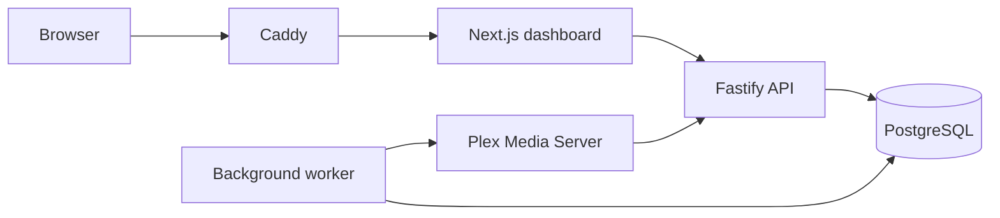

# Musearr architecture at a glance

Musearr is a local-first intelligence layer for a Plex music library. It is not a downloader, player, or Plexamp replacement. Its MVP promises a reliable Plex mirror, useful explainable recommendations and playlists, and review-first metadata intelligence.

## Product boundaries

The first release serves one owner and one Plex connection. It imports artists, albums, tracks, genres, ratings, play history available from Plex, and user playlists. It deliberately keeps external discovery, cloud LLMs, social features, automated metadata writes, and playback control out of the critical path.

Recommendations begin with the user's own library. Deterministic scores and explicit reason codes come before language-model explanations, so results remain fast, private, testable, and trustworthy.

## System design

The browser only uses same-origin API routes. The API is the sole gateway to Plex and PostgreSQL; encrypted Plex credentials never enter the browser. PostgreSQL stores both the library mirror and durable background jobs. The worker performs bounded, retry-safe Plex imports, scheduled reconciliation, playlist imports, and intelligence jobs.

## Data and trust model

Plex identifiers are retained alongside Musearr IDs so records can be reconciled safely. Library imports are idempotent and keep unresolved playlist entries until their tracks are available. The system never silently changes Plex metadata or audio files. Future metadata fixes must be proposed with evidence, approved by the user, and recorded in the audit log.

Secrets are encrypted at rest with an application key. Session cookies are HttpOnly and same-site. CORS, trusted-proxy use, and webhook handling are explicit configuration decisions. Webhook refreshes improve freshness; scheduled reconciliation remains the source-of-truth repair mechanism.

Daily briefings are immutable, timezone-aware snapshots rather than a live query that can change underneath the user. They are generated from stored recommendation, library, and sync facts, then archived locally. Discord delivery is opt-in through a worker-only environment variable; each attempt has a local status so an external outage never loses the briefing or hides its delivery state.

## Growth path

The monorepo separates web, API, worker, contracts, configuration, Plex access, persistence, and intelligence ranking. This makes later additions—multiple users, opt-in enrichment providers, local LLM assistance, Discord briefings, and plugins—additive integrations rather than cross-cutting rewrites. The extension boundary is versioned job and provider interfaces, not arbitrary database access.

For the detailed product plan, see the project documentation maintained with planning materials before implementation. This repository document is the concise, version-controlled implementation reference.
