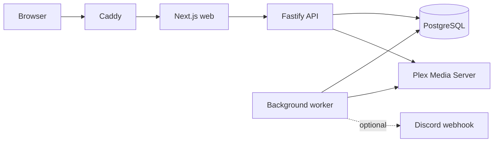

# Musearr product blueprint

## Status

**Design baseline for the first public MVP.** This document is intentionally implementation-neutral: it defines what Musearr must become before new product code broadens the current foundation.

### Implementation progress

**Completed — M1 sync observability foundation:**

- Sync failures persist as safe, stable classifications rather than raw upstream exception text.
- Owner-safe sync-run list and detail API coverage is in place.
- Dashboard library-care UI distinguishes not-started, queued, running, completed, failed, and cancelled states without inventing progress or ETAs.

**Next focus:** fixture-driven Plex import correctness, resumability and recovery verification for the “Trustworthy first library” slice.

## 1. Product vision

Musearr is the private, explainable intelligence layer for a Plex music library. It helps a self-hosting music collector decide what to play from music they already own, rediscover overlooked favourites, and understand the collection without exporting listening data or replacing Plex.

**Core promise:** *library-native curation, locally generated and clearly explained.*

Musearr is not a downloader, player, Plex replacement, generic streaming recommendation feed, or automatic metadata editor.

### MVP outcome

A user can:

1. connect one Plex server and select one or more music libraries;
2. watch a safe, observable local import;
3. see whether their library data is current;
4. receive a short daily listening brief and explainable recommendations; and
5. save or dismiss a suggestion to improve future runs.

The first delightful loop is **Connect → Sync → Today’s brief → Play something meaningful**.

## 2. Product boundaries and non-goals

### In scope

- Plex music mirror: artists, albums, tracks, genres, ratings, play counts, skip counts where Plex exposes them, date added, last played, and user playlists.
- Scheduled reconciliation plus optional webhook-triggered refreshes.
- Deterministic local taste signals: artist, genre, decade, recency, repetition, discovery, diversity, forgotten favourites, and seasonal/time-of-day patterns when source data supports them.
- Explainable recommendation runs and local playlist proposals.
- Immutable daily briefings with optional Discord delivery.
- Review-first metadata issue detection and suggestions; no source mutation in the MVP.

### Explicitly deferred

- Playback, downloads, acquisition, or Plexamp replacement.
- Cloud LLMs, external music discovery, social features, multi-user collaboration, or a public plugin marketplace.
- Automatic Plex metadata/playlist writes.
- Runtime third-party plugins, microservices, Kubernetes, Redis/Kafka, and a general-purpose workflow engine.

## 3. Product principles

1. **Local data is the source of trust.** Plex credentials and listening information remain self-hosted.
2. **Every suggestion earns an explanation.** Reasons come from ranking decisions, never post-hoc marketing copy.
3. **Plex is authoritative.** Musearr mirrors and advises; it does not silently rewrite source records.
4. **Freshness is product information.** A stale or failed sync is visible, actionable state.
5. **The brief exists locally first.** Discord is only a delivery adapter.
6. **Small, reliable habits beat a giant dashboard.** The primary question is always: “What should I play now?”

## 4. Overall architecture

Musearr remains a modular monolith with separately deployable web, API, and worker processes.



### Bounded responsibilities

| Component | Responsibility |
|---|---|
| Web | Same-origin UI only. Never handles Plex credentials or direct database access. |
| API | Session/authentication, request validation, commands, query composition, and webhook ingress. |
| Worker | Durable jobs, Plex sync, reconciliation, rollups, recommendation/brief generation, delivery. |
| PostgreSQL | Source mirror, derived facts, operations state, encrypted secrets, durable job queue. |
| Plex adapter | Transport and Plex-to-normalized record mapping only. |
| Intelligence | Pure candidate selection, deterministic scoring, explanation assembly, and snapshot policy. |

### Architectural rules

- Keep a modular monolith; do not split services without measured operational need.
- Route handlers and jobs invoke application services; they do not contain SQL or Plex mapping logic.
- The Plex adapter owns raw Plex payloads. Domain/application code receives normalized records only.
- All durable jobs have a schema version, idempotency key, correlation ID, and explicit retry class.
- Generated outputs persist input freshness and `algorithmVersion` so they remain explainable and reproducible.

## 5. Technology stack

| Area | Choice | Why |
|---|---|---|
| Language | TypeScript | Shared types/contracts across UI, API, worker, and test suite. |
| Web | Next.js | Existing SSR-capable dashboard shell with strong TypeScript ecosystem. |
| API | Fastify + Zod | Fast, schema-first routes and clear runtime validation. |
| Database | PostgreSQL | Reliable local operational database, indexing, JSONB provenance, transactions, and queue support. |
| Background work | pg-boss | Durable Postgres-backed jobs without adding an operational dependency. |
| Database access | Existing repository/migration layer | Preserve forward-only SQL migration authority. |
| Reverse proxy | Caddy | Simple Docker-first TLS and same-origin routing. |
| Packaging | Docker Compose | Reproducible single-host self-hosting; Linux amd64 and arm64 releases. |
| Testing | Vitest + integration fixtures | Deterministic ranking, contract, sync and migration coverage. |

## 6. Target module structure

Evolve incrementally; avoid a disruptive rewrite.

```text
apps/
  api/src/
    routes/           # route adapters by domain
    composition/      # dependency assembly
    middleware/       # auth, errors, request context
  worker/src/
    jobs/             # versioned handlers
    composition/      # worker dependency assembly and schedules
  web/src/
    app/              # route-level UI
    components/       # shared presentation
    features/         # page/domain compositions
packages/
  contracts/src/      # API/job schemas and public types only
  core/src/           # errors, result, crypto, time, identifiers
  db/src/             # migrations, repositories, queue adapters
  plex/src/           # client, normalized models, mappers
  intelligence/src/   # candidates, policies, reasons, briefing composition
  integrations/src/   # delivery-provider adapters
  domain/src/         # introduce as business vocabulary grows
  application/src/    # introduce once API/worker use cases overlap materially
```

## 7. Data model

The current Plex mirror remains the canonical imported source. New schema work must be additive and follow **expand → backfill → dual-read/write when needed → validate → contract**.

### Core entities

```text
instances
users / instance_memberships / user_preferences
integration_connections -> plex_connections
media_libraries -> media_artists -> media_albums -> media_tracks
source mappings and source payload/hash metadata
listening_events -> daily/weekly/monthly aggregates
taste_profile_runs -> user_taste_signals
algorithm_versions
recommendation_runs -> recommendation_candidates -> recommendation_feedback
playlist_generations -> playlist_generation_items -> playlist_publications
metadata_issues -> metadata_suggestions -> metadata_change_requests
briefings -> briefing_deliveries
sync_runs / import_runs / job_executions / audit_log
```

### Key model decisions

- Add `instance_id`/owner scope consistently to user-owned and generated records now, while retaining a single-owner experience.
- Treat Plex identity as namespaced external identity: `plex:{machineIdentifier}:{entityType}:{ratingKey}`.
- Keep listening facts append-only. Build daily aggregates for dashboard and ranking reads.
- Store source payloads/evidence as JSONB only when they are provenance; promote filter/ranking fields to typed columns.
- Generated recommendations, playlists and briefs reference input watermark, profile run, and algorithm version.
- Keep imported Plex playlists separate from Musearr playlist proposals.
- Metadata proposals contain evidence, confidence, review state, and audit trail. Future writeback is a separate explicit command.

### Critical indexes and retention

- Index source identities by connection/library/rating key and source update time.
- Use keyset pagination indexes for library, recommendation, briefing, metadata review, and sync history reads.
- Index listening facts by `(user_id, occurred_at DESC)` and `(user_id, track_id, occurred_at DESC)`.
- Begin monthly partitioning of raw listening events only when measured volume makes it necessary.
- Keep Plex mirror rows as soft-deleted after a successful absence pass; never hard-delete immediately.
- Retain raw events hot for roughly 13 months, daily rollups for years, immutable briefings for a user-configurable period, and failure/audit records longer than routine success logs.

## 8. API design

All public endpoints live under `/api/v1`. Zod contracts move from a single barrel into domain modules.

```text
contracts/
  common/{errors,pagination,identifiers,jobs}.ts
  auth.ts
  setup.ts
  plex.ts
  sync.ts
  dashboard.ts
  insights.ts
  recommendations.ts
  playlists.ts
  metadata-reviews.ts
  briefings.ts
  system.ts
```

### API conventions

- Direct resource response for a single record; `{ data, page, meta }` for collections.
- Opaque public IDs and RFC 3339 timestamps.
- Cursor/keyset pagination: default 25, max 100.
- `Idempotency-Key` is required for commands that start durable or externally visible work.
- Use RFC 9457 `application/problem+json` errors with stable codes and request IDs.
- Expose freshness, source watermark, and generated algorithm version whenever a view is derived.

### Canonical resources

| Area | Primary endpoints |
|---|---|
| Setup/auth | `GET/POST /setup`, `POST /setup/plex/validate`, `GET/POST/DELETE /auth/session` |
| Plex/sync | `GET /plex/connections`, `GET /libraries`, `POST/GET /sync-runs`, `GET /sync-runs/{id}`, `GET /jobs/{id}` |
| Dashboard | `GET /dashboard`, `GET /insights/listening`, `GET /insights/library`, `GET /insights/trends` |
| Recommendations | `POST/GET /recommendation-runs`, `GET /recommendations`, `GET /recommendations/{id}`, `POST /recommendations/{id}/feedback` |
| Playlists | `GET/POST /playlists`, `GET/PATCH /playlists/{id}`, item routes; export is deferred until explicit write support |
| Metadata | `GET/POST /metadata-reviews`, review decisions and audit history; omit write/apply endpoints until supported |
| Briefings | `POST /briefing-runs`, `GET /briefings`, `GET /briefings/latest`, deliveries/retry routes |
| Operations | `GET /system/health`, `/system/readiness`, `/system/status` |

## 9. Plex sync and background work

### Sync model

Plex is authoritative; webhooks are invalidation hints; scheduled reconciliation repairs missed or reordered events.

1. Validate and persist an encrypted Plex token only after connection succeeds.
2. Queue one bounded initial sync per selected library.
3. Read Plex pages, normalize records, upsert a page and progress checkpoint atomically.
4. Reconcile playlists after tracks.
5. On successful full snapshot only, run the absence pass and soft-mark unseen source rows.
6. Queue aggregate/recommendation work only when sync changed relevant source state.

### Job taxonomy

```text
library.sync.v1
playlist.sync.v1
library.reconcile.v1
rollups.rebuild.v1
recommendations.generate.v1
brief.generate.v1
brief.deliver.v1
```

Jobs are at-least-once. Database uniqueness and idempotent upserts create exactly-once *effects*. Serialise a library section in the MVP; add bounded cross-section concurrency only after observing Plex behavior.

### Retry policy

Retry network failures, timeouts, 429s, 5xx responses and transient DB errors with exponential full jitter. Credentials errors, bad encryption, and invalid configuration are terminal/degraded states—not retry loops. Never run an absence pass after a failed sync.

## 10. Dashboard and UI layout

### Information architecture

```text
/                 Today’s brief and current next action
/playlists        Local playlist proposals and imported Plex playlists
/discover         Recommendations and explanation detail
/library          Local mirror browse and library health
/insights         Listening patterns and trend evidence
/metadata         Review-first issue/proposal queue
/settings         Plex, sync, briefing, privacy, and session settings
```

### Home composition

1. **Today’s mix** — dominant decision card with 3–5 picks and a generate/open action.
2. **Why these picks** — reason chips and factual detail drawer.
3. **Daily brief** — immutable snapshot, freshness, archive, delivery state.
4. **Library pulse** — concise counts and recently added/listened context.
5. **Listening highlights** — ranked artists/genres and an honest data-coverage label.
6. **Sync health** — lower-priority unless setup incomplete, syncing or degraded.
7. **Metadata review teaser** — only when proposals require attention.

### UX rules

- Design character: a private listening room—editorial and calm, not an enterprise control panel.
- Always show why, freshness, and local-only/read-only boundaries.
- Use drawers for explanation and evidence instead of route churn.
- Setup is staged: privacy boundary → test connection → choose libraries → confirm → visible sync progress.
- Metadata page says: **“Musearr proposes. You decide. Nothing is written to Plex automatically.”**
- Meet WCAG 2.2 AA: keyboard navigation, semantic landmarks, focus-managed dialogs, text alternatives for charts, non-colour state indicators, and user-local times.

## 11. Docker and production operations

### Deployment topology

One private host running Caddy, web, API, worker, one-shot migrations and PostgreSQL. Only Caddy publishes ports 80/443; database, API, web and worker stay internal.

### Before a real deployment

- Remove all secret defaults, especially the PostgreSQL password; fail closed on missing production variables.
- Require a canonical TLS hostname and redirect HTTP to HTTPS.
- Deploy release images by immutable digest, not mutable tags.
- Pin base image digests and GitHub Actions to reviewed versions.
- Harden runtime containers with dropped capabilities, `no-new-privileges`, read-only roots where compatible, tmpfs, PID/resource limits, and non-root users.
- Add API, web, Caddy, Postgres and worker readiness/heartbeat signals.
- Back up Postgres off-host daily with encryption; test a restore monthly. The application encryption key is a data-recovery secret and must be backed up separately.
- Use structured, redacted logs and alerts for backup age, disk use, worker heartbeat, queue age, sync freshness and certificate expiry.
- CI gates: lint, typecheck, unit/integration/migration tests, Compose validation, image build, secret/dependency/image scans, SBOM/provenance and signed images.

## 12. Roadmap and milestone plan

| Milestone | Outcome | Exit gate |
|---|---|---|
| M0 — Product/release guardrails | Scope, fixtures, event taxonomy and release scorecard | Approved MVP boundary and seed-library fixture |
| M1 — Trustworthy Plex mirror | Setup, safe import, sync observability, reconcile and recovery | 100% fixture import parity; zero duplicates; actionable failed-sync UI |
| M2 — Intelligence read model | Dashboard, library health, listening summaries and fast queries | User can answer what they own, hear, and whether data is current |
| M3 — Explainable recommendations | Deterministic policy, reasons, cooldown/diversity and feedback | Every result is reproducible and has persisted reason codes |
| M4 — Playlist proposals | Reviewable, reproducible local listening plans | Saved 30–60 minute proposal without Plex write permission |
| M5 — Daily briefing | Immutable local brief and optional, idempotent Discord delivery | Local brief remains useful when delivery is disabled or fails |
| M6 — Release candidate | Secure Docker install, backups, tests, observability and beta docs | Two clean-host installations succeed from documentation |

### First implementation slice: Trustworthy first library

Implement only this vertical slice after design sign-off:

- setup/sync/dashboard contracts;
- a fake Plex fixture plus expected entity manifest;
- sync progress and sanitized error classification;
- worker checkpoint/retry/idempotency coverage;
- setup UI and minimal dashboard freshness/count/status states;
- end-to-end test: setup → sync → dashboard summary.

**Non-goals:** recommendation expansion, playlist writes, Discord polish, LLMs, external enrichment, multi-user and automatic metadata changes.

## 13. Future scalability considerations

The design prepares, but does not implement, multi-user and additional providers.

- Scope all owned/generated rows with an instance/owner ID now.
- Model external connections and `(provider_id, external_id)` mappings so Plex is not hardcoded throughout future domain tables.
- Keep providers compile-time registered in-process interfaces first. If an external ecosystem is justified later, isolate plugins out-of-process behind versioned RPC contracts.
- Use profile and algorithm versions, source watermarks, and immutable snapshots to support offline evaluation and later optional models.
- Keep dashboard endpoints bounded and backed by read models; introduce dedicated search/analytics stores only after measured query pressure.
- Move from serial sync to bounded per-source concurrency only after observability and live-server performance evidence.
- Add external enrichment, writeback, local LLM and multi-user support as separately approved capability sets, each with consent, security, audit and retention design.

## Decision record

**Chosen foundation:** an explainable, deterministic, read-only Plex companion that produces a trusted daily listening decision from a reliable local mirror.

**Deliberately rejected for MVP:** a broad AI platform, remote-first recommendation service, autonomous metadata editor, and distributed microservice architecture.
